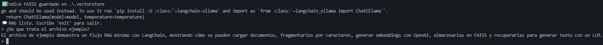
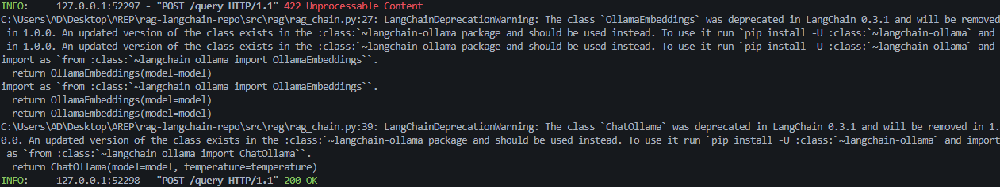
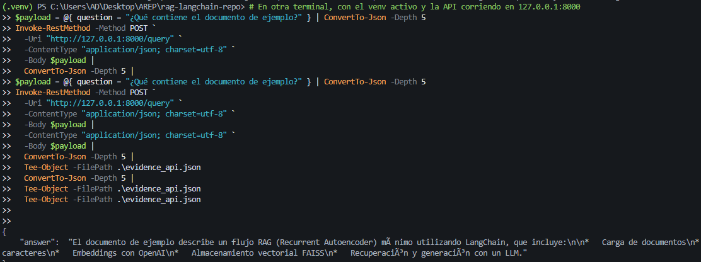

# RAG con LangChain

**Objetivo:** Implementar un sistema de *Retrieval-Augmented Generation (RAG)* que responda preguntas usando tus propios documentos, siguiendo la guía de LangChain, con dos backends intercambiables: **OpenAI** (requiere API key) u **Ollama** (100% local y gratis).

## Arquitectura
- **Loaders** (`DirectoryLoader`, `PyPDFLoader`, `TextLoader`) — leen PDFs/TXT/MD.
- **Splitter** (`RecursiveCharacterTextSplitter`) — fragmenta documentos en *chunks*.
- **Embeddings**  
  - `OpenAIEmbeddings` (si usas OpenAI), o  
  - `OllamaEmbeddings` (si usas Ollama / local).
- **Vector store** (FAISS) — indexa los vectores para recuperación semántica.
- **Retriever** — busca los *k* fragmentos más relevantes.
- **LLM**  
  - `ChatOpenAI` (OpenAI), o  
  - `ChatOllama` (Ollama / local).
- **Chain (LCEL)** — tubería con `Runnable` + `ChatPromptTemplate` + `StrOutputParser`.

```
[Docs] -> [Loaders] -> [Splitter] -> [Embeddings] -> [FAISS] -> [Retriever]
                                                          | 
                  pregunta --------------------------------┘
                           v
                 [Prompt] -> [LLM (OpenAI u Ollama)] -> respuesta
```

## Requisitos
- Python 3.9+
- **Backend a elegir (uno de los dos):**
  - **OpenAI**: cuenta + `OPENAI_API_KEY`.
  - **Ollama (recomendado si no tienes saldo)**: instalación local de Ollama y modelos open-source.

## Instalación
```bash
# 1) crear entorno
python -m venv .venv && source .venv/bin/activate
# En Windows PowerShell: .venv\\Scripts\\Activate.ps1

# 2) instalar dependencias
pip install -r requirements.txt

# 3) variables base
cp .env.example .env
# edita .env si usarás OPENAI (ver más abajo “Elegir backend”)
```

## Elegir backend

### A) OpenAI (requiere API key)
- Edita `.env` y coloca `OPENAI_API_KEY=...` (opcional `OPENAI_MODEL`).
- No definas `RAG_BACKEND` (modo `auto` usa OpenAI si hay API key), o pon:
  - `RAG_BACKEND=openai`

**Windows PowerShell (session actual):**
```powershell
$env:OPENAI_API_KEY = "tu_api_key"
# opcional:
$env:OPENAI_MODEL = "gpt-4o-mini"
$env:RAG_BACKEND = "openai"
```

### B) Ollama (100% local y gratis)
1) Instala Ollama y verifica:
```powershell
winget install Ollama.Ollama
ollama --version
```
2) Descarga modelos (uno LLM y uno de embeddings):
```powershell
ollama pull llama3.2
ollama pull nomic-embed-text
```
3) Instala soporte de LangChain para Ollama:
```powershell
pip install -U langchain-ollama
```
4) Variables de entorno para esta sesión:
```powershell
$env:RAG_BACKEND = "ollama"
$env:OLLAMA_MODEL = "llama3.2"
$env:EMBEDDING_MODEL = "nomic-embed-text"
```
5) (Opcional) Verifica que el servicio de Ollama responda:
```powershell
Invoke-RestMethod http://localhost:11434/api/tags | Out-Null
```

**Nota:** El repo detecta el backend automáticamente (`RAG_BACKEND=auto` por defecto): si existe `OPENAI_API_KEY` usa OpenAI; si no, intenta Ollama. Puedes forzar uno con `RAG_BACKEND=openai` u `ollama`.

## Ingesta de documentos (indexado)
Coloca tus archivos en `./data` (PDF, TXT, MD). Luego ejecuta:
```bash
python -m src.rag.ingest --data_dir ./data --persist_dir ./.vectorstore --chunk_size 800 --chunk_overlap 120
```
Esto crea/actualiza un índice FAISS persistente en `./.vectorstore`.

## Chat (CLI)
```bash
python -m src.rag.chat_cli --persist_dir ./.vectorstore
# escribe tu pregunta, por ejemplo:
# > ¿De qué trata el archivo de ejemplo?
```

## API HTTP (FastAPI opcional)
Inicia un servicio local para consultas vía REST:
```bash
uvicorn src.rag.api:app --reload --port 8000
# POST http://localhost:8000/query  body: {"question": "tu pregunta"}
```

### Ejemplos
**Curl**
```bash
curl -s -X POST http://localhost:8000/query \
  -H "Content-Type: application/json" \
  -d '{"question":"¿Qué contiene el documento de ejemplo?"}' | jq
```

**Windows PowerShell**
```powershell
Invoke-RestMethod -Method POST `
  -Uri "http://localhost:8000/query" `
  -ContentType "application/json" `
  -Body '{"question":"¿Qué contiene el documento de ejemplo?"}'
```

## Estructura del repo
```
.
├── data/                        # tus PDFs/TXT/MD
├── src/
│   └── rag/
│       ├── api.py               # FastAPI con /query
│       ├── chat_cli.py          # REPL en terminal
│       ├── ingest.py            # indexado/actualización de FAISS
│       └── rag_chain.py         # construcción del retriever y RAG chain          
├── .env.example
├── requirements.txt
├── README.md
└── .vectorstore/                # (se genera tras la ingesta)
```

## Buenas prácticas aplicadas
- Uso de paquetes modulares de LangChain (`langchain_openai`, `langchain_community`, `langchain_text_splitters`) y **`langchain-ollama`** cuando se usa backend local.
- Cadena tipo LCEL con `RunnablePassthrough` y `StrOutputParser`.
- Persistencia en disco con `FAISS.save_local`/`FAISS.load_local` (con `allow_dangerous_deserialization=True` para índices propios).
- Separación de responsabilidades: *ingesta* vs *serving* (CLI/API).
- Variables de entorno (`.env`) y *type hints*.
- **Backend conmutable** vía `RAG_BACKEND` (`auto`/`openai`/`ollama`).

## Cómo ejecutar las pruebas
```bash
pytest -q
```
> El test de ejemplo usa OpenAI por defecto y **se salta** si no hay `OPENAI_API_KEY`.

## Solución de problemas
- **Deprecation warnings de Ollama en LangChain:** instala `langchain-ollama` y usa  
  `from langchain_ollama import OllamaEmbeddings, ChatOllama`.
- **Ollama no responde:** asegúrate de haber hecho `ollama pull ...` y que el servicio esté activo  
  (`Invoke-RestMethod http://localhost:11434/api/tags | Out-Null`).
- **FAISS en Windows:** viene fijado en `requirements.txt`. Si tu entorno falla, revisa la versión de Python o reinstala el wheel.

## Evidencias

**Evidencia del modelo respondiendo (Chat CLI):**



**Evidencia de ingesta:**

Ver archivo ``evidence_ingesta.txt``

**Evidencia de API/Query:**

Ver archivo ``evidence_api.json``





## Licencia
MIT
